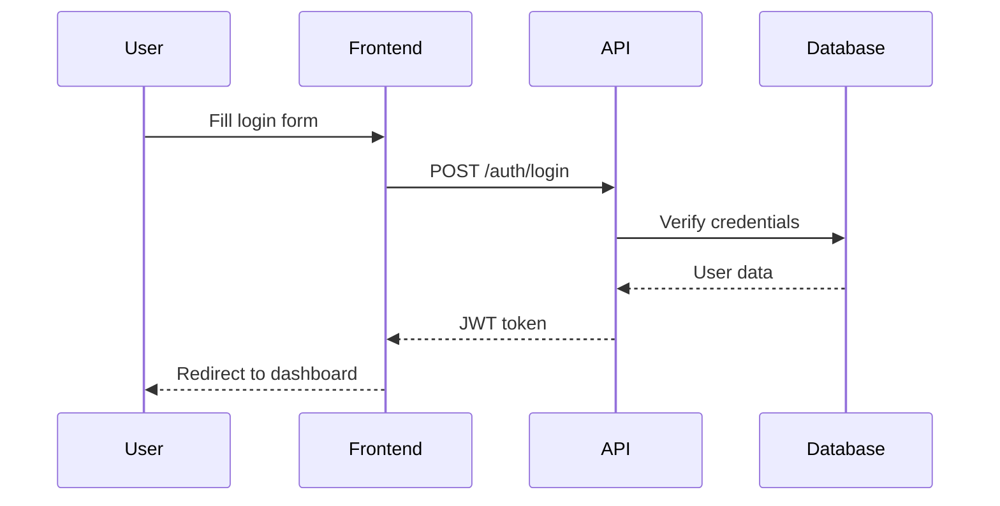

# Technical Writing

> **Quick Reference:** Clear, concise documentation of technical information for specific audiences
> **Use when:** Creating docs, tutorials, API references, or any technical communication

## When to Use

- ✅ Writing API documentation and developer guides
- ✅ Creating user manuals and how-to tutorials
- ✅ Documenting system architecture and design decisions
- ✅ Writing README files and project documentation
- ✅ Creating technical specifications and requirements
- ❌ **NOT for:** Marketing copy, creative writing, or informal communication

## Core Concepts

### 1. Know Your Audience

```
STRUCTURE Audience
    role: developer | end_user | technical_writer | manager
    expertise: beginner | intermediate | expert
    goals: learn | implement | troubleshoot | decide
    context: time_constrained | exploring | problem_solving

FUNCTION tailor_content(audience)
    IF audience.expertise == beginner THEN
        - Define all terms
        - Include step-by-step instructions
        - Add screenshots and examples
        - Avoid assumptions
    ELSE IF audience.expertise == expert THEN
        - Use technical terminology
        - Focus on advanced concepts
        - Provide reference material
        - Skip basic explanations
    
    IF audience.role == developer THEN
        - Include code examples
        - Show API references
        - Explain technical details
    ELSE IF audience.role == end_user THEN
        - Focus on tasks and outcomes
        - Use plain language
        - Emphasize UI/workflow
```

### 2. Structure and Organization

**Information Hierarchy:**
```
Document Structure (Top-Down)
├── Title (What is this?)
├── Introduction/Overview (Why should I care?)
├── Prerequisites (What do I need?)
├── Main Content
│   ├── Concepts (What should I know?)
│   ├── Procedures (How do I do it?)
│   ├── Examples (Show me)
│   └── Reference (Quick lookup)
├── Troubleshooting (What if it breaks?)
└── Related Resources (Where do I learn more?)
```

**The Pyramid Principle:**
```
Start with conclusion/answer
    ├── Key point 1
    │   ├── Supporting detail
    │   └── Example
    ├── Key point 2
    │   ├── Supporting detail
    │   └── Example
    └── Key point 3
```

### 3. Writing Style Principles

**Clear and Concise:**
```
❌ BAD: "In order to facilitate the process of authentication..."
✅ GOOD: "To authenticate..."

❌ BAD: "The system will perform a validation check on the input data"
✅ GOOD: "The system validates the input"

❌ BAD: "It is recommended that users should consider..."
✅ GOOD: "Users should..." or "We recommend..."
```

**Active Voice:**
```
❌ PASSIVE: "The file is processed by the server"
✅ ACTIVE: "The server processes the file"

❌ PASSIVE: "An error will be returned if validation fails"
✅ ACTIVE: "The API returns an error if validation fails"
```

**Parallel Structure:**
```
❌ NOT PARALLEL:
- Configure the database
- Authentication setup
- Starting the server

✅ PARALLEL:
- Configure the database
- Set up authentication
- Start the server
```

### 4. Documentation Types

**API Documentation:**
````markdown
## POST /api/users

Creates a new user account.

### Request

**Endpoint:** `POST https://api.example.com/v1/users`

**Headers:**
- `Content-Type: application/json`
- `Authorization: Bearer {token}`

**Body Parameters:**

| Parameter | Type | Required | Description |
|-----------|------|----------|-------------|
| `username` | string | Yes | Unique username (3-20 chars) |
| `email` | string | Yes | Valid email address |
| `password` | string | Yes | Minimum 8 characters |

**Example Request:**
```json
{
  "username": "johndoe",
  "email": "john@example.com",
  "password": "SecurePass123"
}
```

**Response:**

**Success (201 Created):**
```json
{
  "id": 12345,
  "username": "johndoe",
  "email": "john@example.com",
  "createdAt": "2026-02-02T10:00:00Z"
}
```

**Errors:**
- `400 Bad Request`: Invalid input data
- `409 Conflict`: Username or email already exists
- `401 Unauthorized`: Invalid or missing token
```

**Tutorial/How-To:**
```markdown
# How to Deploy a Docker Container to AWS

Learn how to deploy a containerized application to AWS ECS in 10 minutes.

## Prerequisites

Before starting, ensure you have:
- Docker installed locally
- AWS CLI configured with credentials
- An AWS account with ECS permissions

## Step 1: Build Your Docker Image

First, create a Dockerfile in your project root:

```dockerfile
FROM node:18-alpine
WORKDIR /app
COPY package*.json ./
RUN npm install
COPY . .
EXPOSE 3000
CMD ["npm", "start"]
```

Build the image:
```bash
docker build -t my-app:latest .
```

## Step 2: Push to Amazon ECR

[Continue with clear, sequential steps...]

## Troubleshooting

**Problem:** "Permission denied" error when pushing to ECR

**Solution:** Ensure your AWS credentials have `ecr:PutImage` permission...
````

### 5. Visual Communication

**When to Use Visuals:**
```
Diagrams:
- System architecture
- Data flow
- Process workflows
- Relationships

Screenshots:
- UI walkthroughs
- Configuration steps
- Result verification

Code Examples:
- API usage
- Configuration files
- Common patterns

Tables:
- Parameter references
- Comparison matrices
- Status codes
```

**Diagram Example (Mermaid):**
````markdown

````

## Best Practices

1. **Front-load important information:** Lead with the answer, then provide details
2. **Use consistent terminology:** Pick one term and stick with it (avoid "user" then "customer" then "client")
3. **Write scannable content:** Use headings, bullets, bold text, and short paragraphs
4. **Provide context early:** Explain what, why, and who-for in the introduction
5. **Include examples for everything:** Show concrete usage, not just abstract concepts
6. **Test your documentation:** Have someone follow your instructions before publishing
7. **Keep it up to date:** Mark deprecated features, update for new versions
8. **Use templates:** Standardize structure across similar documents

## Common Pitfalls

- ❌ **Assuming knowledge:** "Simply configure the API" → Explain HO