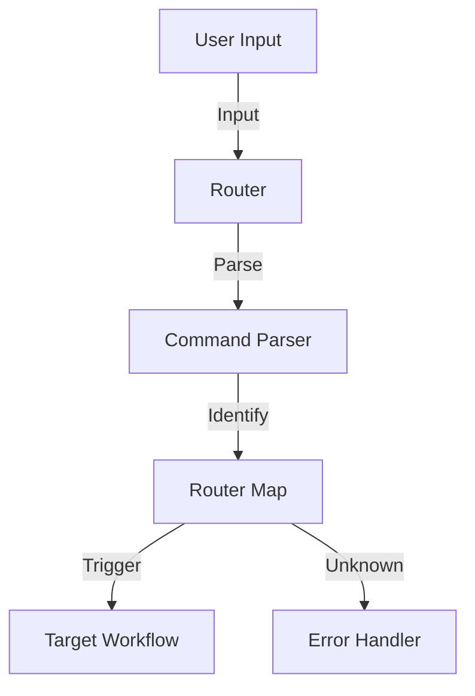

# Master Router Documentation

> **Status:** Draft
> **Feature:** Command Router & Chat Grammar
> **Protocol:** `.prompt-os/core/COMMAND-ROUTER.md`

## Overview

The **Master Router** is a core component of Itzamna PromptOS responsible for parsing user commands and routing them to the appropriate workflows. It provides a standardized command-line interface (CLI) experience within the chat window, enabling consistent behavior across different AI models.

## Key Features

- **Strict Start-of-Line Parsing:** Commands are only recognized if they appear at the very beginning of a message.
- **Standardized Grammar:** Supports `command [subcommand] [args...] [--flags]`.
- **Core Commands:** `#init`, `#add`, `#sync`, `#update`, etc.
- **Model Agnostic:** Designed to work identically across Claude, GPT-4, Gemini, etc.

## Architecture

The Router sits between the User Input and the Workflow Execution:



## Grammar Summary

The command structure follows a strict grammar defined in `.prompt-os/core/COMMAND-ROUTER.md`:

```ebnf
command_message = command_prefix , command_name , [ space , subcommand ] , { space , argument } , { space , flag } ;
```

- **Prefix:** Must start with `#` (e.g., `#init`).
- **Subcommands:** Optional second word (e.g., `#add agent`).
- **Arguments:** Space-separated. Use quotes for strings with spaces (e.g., `"my project"`).
- **Flags:** Optional modifiers starting with `--` (e.g., `--here`, `--dry-run`).

## Cheat Sheet

| Command | Usage | Description |
|---------|-------|-------------|
| `#init` | `#init` | Initialize a new project or agent structure. |
| `#add` | `#add agent "Name"` | Add a new agent to the system configuration. |
| `#sync` | `#sync` | Synchronize context files and indices. |
| `#update` | `#update` | Update system components or dependencies. |
| `#impl` | `#impl "Card Name"` | Trigger standard implementation flow. |
| `#docs` | `#docs` | Trigger documentation workflow. |
| **Flags** | | |
| `--here` | `#init --here` | Execute in current context/directory only. |
| `--ia` | `#cmd --ia architect` | Route command to specific agent. |
| `--dry-run` | `#sync --dry-run` | Simulate execution without changes. |
| `--help` | `#add --help` | Show usage help for the command. |
| `--persona` | `#impl --persona architect` | Override the default persona for the workflow. |
| `--skills` | `#review --skills tdd,security-basics` | Add specific skills to the active skill set. |

## Workflow Orchestrator Integration

The Router now integrates with the **Workflow Orchestrator** to automatically select personas and skills for each workflow command.

### Persona Override (`--persona`)

Override the default persona assigned to a workflow:

- **Syntax:** `#workflow --persona {persona_shorthand}`
- **Valid personas:** `owner`, `engineer`, `debugger`, `reviewer`, `writer`, `qa`, `architect`
- **Example:** `#impl --persona architect` (uses Solutions Architect instead of Software Engineer)
- **Fallback:** If invalid persona is specified, the system warns and uses the workflow default

### Skills Override (`--skills`)

Add specific skills to the active skill set:

- **Syntax:** `#workflow --skills {skill1,skill2,...}`
- **Merge behavior:** Explicit skills are added first (priority), then default skills are appended
- **Cap enforcement:** If total exceeds 5 skills, default skills are evicted in reverse priority order
- **Example:** `#review --skills tdd,system-design` (adds TDD and System Design to code review defaults)
- **Warning:** System notifies if skills are evicted due to the 5-skill cap

### Combined Example

```bash
#impl --persona architect --skills tdd,security-basics
```

This command:
1. Triggers `#impl` workflow (implementation)
2. Overrides persona to **Solutions Architect** (instead of default Software Engineer)
3. Adds **tdd** and **security-basics** to the skill set
4. Merges with default skills: `[tdd, security-basics, {stack-skill}, clean-code, software-testing]`
5. If total > 5, evicts lowest priority default skills

For details on persona and skill resolution, see `.prompt-os/core/WORKFLOW-ORCHESTRATOR.md`.

## Troubleshooting

### Command Not Recognized?
1. **Check Start of Line:** The command **MUST** be the very first thing in your message.
   - ❌ `Hi, please run #init` (Ignored)
   - ✅ `#init` (Executed)
2. **Check Spacing:** Arguments are space-separated.
   - ❌ `#add agent My Agent` (Parsed as arg1="My", arg2="Agent")
   - ✅ `#add agent "My Agent"` (Parsed as arg1="My Agent")
3. **Check Quotes:** Ensure you match your quotes (`"` or `'`).

### Wrong Agent Responding?
- Use the `--ia {agent_name}` flag to force a specific agent to handle the command.
  - Example: `#impl "Feature X" --ia architect`

### Unsure of Syntax?
- Append `--help` to any command to see its specific usage.
  - Example: `#add --help`
