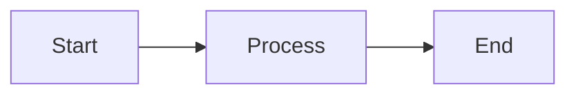

# Markdown

> **Quick Reference:** Lightweight markup language for readable formatted text
> **Use when:** Writing documentation, READMEs, blogs, or any human-readable formatted content

## When to Use

- ✅ Creating README files and project documentation
- ✅ Writing technical blog posts or articles with code snippets
- ✅ Generating static site content (Jekyll, Hugo, Docusaurus)
- ✅ Taking notes with structure and formatting
- ✅ Creating GitHub issues, pull requests, and comments
- ❌ **NOT for:** Complex page layouts, print-ready documents, or when precise styling control is required

## Core Concepts

### 1. Headers and Structure

Headers create document hierarchy using `#` symbols (1-6 levels).

```markdown
# H1 - Main Title
## H2 - Section
### H3 - Subsection
#### H4 - Minor heading
##### H5 - Rarely used
###### H6 - Deepest level

Alternative syntax for H1 and H2:
Main Title
==========

Section
-------
```

**Best practice:** Use only one H1 per document, maintain hierarchy (don't skip levels).

### 2. Text Formatting

```markdown
**bold text** or __bold text__
*italic text* or _italic text_
***bold and italic*** or ___both___
~~strikethrough~~
`inline code`
> Blockquote
>> Nested blockquote
```

**Escaping:** Use backslash `\` to display literal characters: `\*not italic\*`

### 3. Lists and Nesting

```markdown
Unordered lists:
- Item 1
- Item 2
  - Nested item (2 spaces)
  - Another nested
- Item 3

Ordered lists:
1. First item
2. Second item
   1. Nested ordered
   2. Another nested
3. Third item

Task lists (GitHub):
- [x] Completed task
- [ ] Pending task
```

### 4. Links and Images

```markdown
[Link text](https://example.com)
[Link with title](https://example.com "Hover title")
[Reference link][ref-id]

[ref-id]: https://example.com "Reference definition"


[](full-image.jpg)

Automatic links:
<https://example.com>
<email@example.com>
```

### 5. Code Blocks and Syntax Highlighting

`````markdown
Inline code: `console.log('hello')`

Fenced code blocks with syntax highlighting:
```javascript
function greet(name) {
  return `Hello, ${name}!`;
}
```

```python
def calculate(x, y):
    """Docstring example"""
    return x + y
```

Indented code blocks (legacy):
    function legacy() {
        return "4 spaces indent";
    }

Escaping code blocks (use more backticks):
````markdown
```python
# Nested code block
print("Use 4 backticks when showing 3")
```
````
`````

### 6. Tables (Extended Syntax)

```markdown
| Header 1 | Header 2 | Header 3 |
|----------|----------|----------|
| Cell 1   | Cell 2   | Cell 3   |
| Cell 4   | Cell 5   | Cell 6   |

Alignment:
| Left | Center | Right |
|:-----|:------:|------:|
| L1   | C1     | R1    |
| L2   | C2     | R2    |

Minimal syntax:
Header 1|Header 2
---|---
Data 1|Data 2
```

### 7. Advanced Features (GitHub Flavored Markdown)

````markdown
Footnotes:
Here's a sentence with a footnote[^1].

[^1]: This is the footnote content.

Definition lists:
Term
: Definition 1
: Definition 2

Emoji:
:smile: :rocket: :tada:

Math (some renderers):
Inline: $E = mc^2$
Block: $$\sum_{i=1}^{n} x_i$$

Mermaid diagrams:


HTML embedding (when allowed):
<details>
  <summary>Click to expand</summary>
  Hidden content here
</details>
````

## Best Practices

1. *Use blank lines for separation:* Always separate blocks (paragraphs, lists, code) with blank lines for proper rendering
2. *Maintain header hierarchy:* Use H1 once, then H2, H3 sequentially—don't skip levels
3. *Add alt text to images:* Improves accessibility and provides context when images fail to load
4. *Prefer fenced code blocks:* Use ``` with language identifiers instead of indented blocks for better syntax highlighting
5. *Use reference links for readability:* Define links at bottom when same URL is used multiple times
6. *Keep line length reasonable:* Aim for 80-100 characters per line in source for better version control diffs
7. *Use consistent list markers:* Stick to - or * for unordered lists throughout document
8. *Escape with extra backticks:* When showing code blocks inside code blocks, use one more backtick than the inner block (3 inside 4, 4 inside 5)

## Common Pitfalls
- ❌ Missing blank lines: Text running together without separation → Always add blank line between different block elements
- ❌ Inconsistent indentation in lists: Broken nesting → Use exactly 2 or 4 spaces consistently
- ❌ Forgetting language in code blocks: No syntax highlighting → Always specify: ```python
- ❌ Using headers for styling: Making text big instead of structure → Use headers only for document hierarchy
- ❌ Not escaping special characters: Unwanted formatting → Use backslash: \*literal asterisk\*
- ❌ Mixing ordered/unordered incorrectly: Confusing hierarchy → Be deliberate about list type choice
- ❌ Assuming all Markdown is the same: Features vary by renderer → Test with your target platform (GitHub, Hugo, etc.)
- ❌ Wrong backtick count for nested code: Inner block escapes outer → Use N+1 backticks (4 to wrap 3, 5 to wrap 4)

## Related Skills
- *html* - Markdown compiles to HTML, can embed HTML directly
- *git* - Version control for Markdown documentation
- *technical-writing* - Writing clear documentation
- *static-site-generators* - Building sites from Markdown

## Examples
📚 Detailed implementations: → View [markdown-examples](exemples/markdown-examples.md)