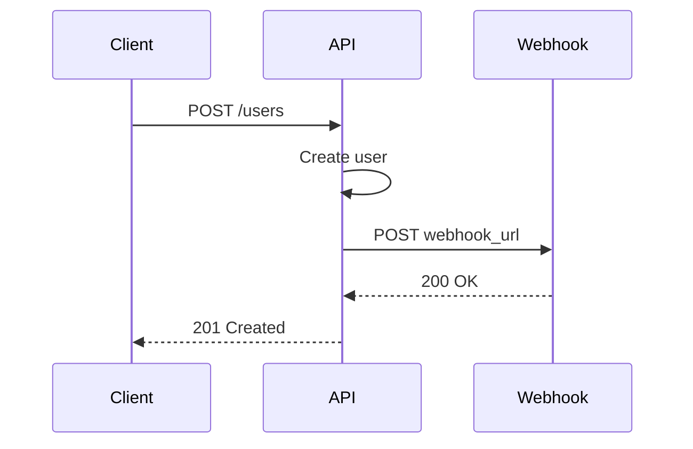
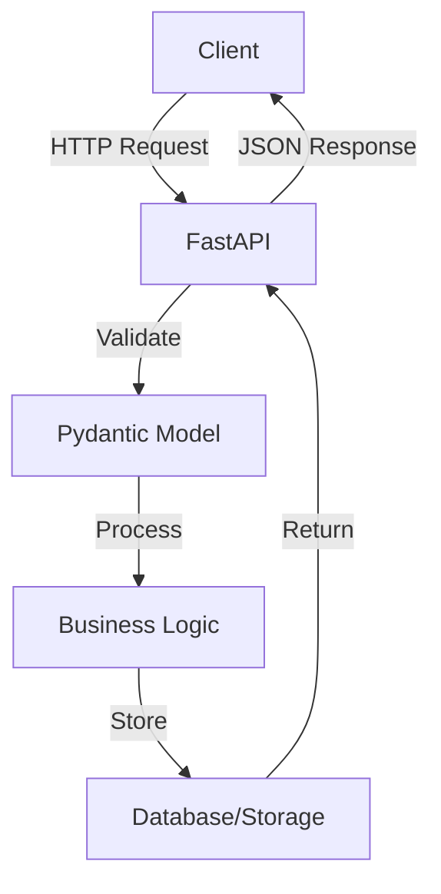
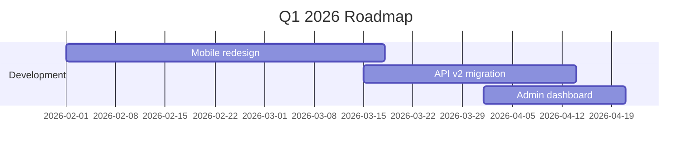

# Markdown Examples - Detailed Implementations

> **Companion file for:** [markdown/SKILL.md](../markdown/SKILL.md)

---

## Example 1: Complete README Structure

````markdown
# Project Name


[]()
[]()

> A brief, compelling description of what your project does

## 🚀 Features

- **Feature 1**: Description with emphasis
- **Feature 2**: Another key feature
- **Feature 3**: What makes it special

## 📦 Installation

```bash
npm install project-name
# or
pip install project-name
```

## 🎯 Quick Start

```javascript
const project = require('project-name');

project.doSomething({
  option: 'value'
});
```

## 📖 Documentation

Full documentation available at [docs.example.com](https://docs.example.com)

### Configuration

| Option | Type | Default | Description |
|--------|------|---------|-------------|
| `mode` | string | `'auto'` | Operation mode |
| `verbose` | boolean | `false` | Enable logging |
| `timeout` | number | `5000` | Timeout in ms |

## 🤝 Contributing

Contributions welcome! Please read [CONTRIBUTING.md](CONTRIBUTING.md) first.

1. Fork the repository
2. Create feature branch (`git checkout -b feature/AmazingFeature`)
3. Commit changes (`git commit -m 'Add AmazingFeature'`)
4. Push to branch (`git push origin feature/AmazingFeature`)
5. Open Pull Request

## 📝 License

This project is licensed under the MIT License - see [LICENSE](LICENSE) file.

## 🙏 Acknowledgments

- Hat tip to [contributor](https://github.com/user)
- Inspired by [project](https://example.com)
````

---

## Example 2: Technical Documentation with Advanced Features

````markdown
# API Reference Guide

## Authentication

All API requests require authentication using Bearer tokens:

```http
GET /api/v1/users
Authorization: Bearer YOUR_TOKEN_HERE
```

### Response Format

```json
{
  "status": "success",
  "data": {
    "id": 123,
    "name": "John Doe"
  },
  "meta": {
    "timestamp": "2026-02-02T10:00:00Z"
  }
}
```

## Endpoints

### GET /api/v1/users

Retrieves list of users.

**Parameters:**

| Name | Type | Required | Description |
|------|------|----------|-------------|
| `page` | integer | No | Page number (default: 1) |
| `limit` | integer | No | Items per page (default: 20) |
| `sort` | string | No | Sort field (default: 'created_at') |

**Example Request:**

```bash
curl -X GET "https://api.example.com/v1/users?page=1&limit=10" \
  -H "Authorization: Bearer token123"
```

**Example Response:**

```json
{
  "data": [
    {"id": 1, "name": "Alice"},
    {"id": 2, "name": "Bob"}
  ],
  "pagination": {
    "current_page": 1,
    "total_pages": 5
  }
}
```

---

### POST /api/v1/users

Creates a new user.

<details>
<summary><strong>Show detailed request body</strong></summary>

```json
{
  "name": "Jane Smith",
  "email": "jane@example.com",
  "role": "admin",
  "metadata": {
    "department": "Engineering",
    "location": "Remote"
  }
}
```

</details>

**Validation Rules:**

- [x] `name`: Required, 2-100 characters
- [x] `email`: Required, valid email format
- [ ] `role`: Optional, one of: `admin`, `user`, `guest`

> **⚠️ Warning:** Creating admin users requires elevated permissions.

---

## Error Handling

The API uses conventional HTTP response codes:

| Code | Meaning | Description |
|------|---------|-------------|
| 200 | OK | Request succeeded |
| 400 | Bad Request | Invalid parameters |
| 401 | Unauthorized | Missing/invalid token |
| 404 | Not Found | Resource doesn't exist |
| 500 | Server Error | Something went wrong |

**Error Response Format:**

```json
{
  "status": "error",
  "error": {
    "code": "VALIDATION_ERROR",
    "message": "Invalid email format",
    "details": {
      "field": "email",
      "received": "not-an-email"
    }
  }
}
```

## Rate Limiting

> **Note:** API is rate limited to 1000 requests per hour per token.

Current limit info is included in response headers:

```
X-RateLimit-Limit: 1000
X-RateLimit-Remaining: 847
X-RateLimit-Reset: 1643723400
```

## Webhooks

Configure webhooks to receive real-time notifications:



## Footnotes & References

This API follows REST principles[^1] and uses JSON:API specification[^2].

[^1]: [REST Architecture](https://restfulapi.net/)
[^2]: [JSON:API Spec](https://jsonapi.org/)

---

**Last Updated:** 2026-02-02 | **Version:** 2.1.0
````

---

## Example 3: Blog Post with Images and Code

````markdown
# Building a REST API with Python FastAPI

*Published: February 2, 2026 | Reading time: 8 minutes*


## Introduction

FastAPI is a modern, fast web framework for building APIs with Python 3.7+. In this tutorial, we'll build a complete CRUD API.

## Prerequisites

Before starting, ensure you have:

- Python 3.8 or higher
- Basic understanding of async/await
- Familiarity with REST concepts

## Step 1: Installation

Create a virtual environment and install dependencies:

```bash
# Create virtual environment
python -m venv venv
source venv/bin/activate  # On Windows: venv\Scripts\activate

# Install FastAPI and server
pip install fastapi uvicorn[standard]
```

## Step 2: Basic Application

Create `main.py`:

```python
from fastapi import FastAPI, HTTPException
from pydantic import BaseModel
from typing import List, Optional

app = FastAPI(
    title="My API",
    description="A simple CRUD API",
    version="1.0.0"
)

# Data model
class Item(BaseModel):
    id: Optional[int] = None
    name: str
    description: Optional[str] = None
    price: float
    
    class Config:
        schema_extra = {
            "example": {
                "name": "Widget",
                "description": "A useful widget",
                "price": 29.99
            }
        }

# In-memory storage
items_db: List[Item] = []
next_id = 1

# Routes
@app.get("/")
async def root():
    return {"message": "Welcome to my API"}

@app.get("/items", response_model=List[Item])
async def list_items():
    return items_db

@app.post("/items", response_model=Item, status_code=201)
async def create_item(item: Item):
    global next_id
    item.id = next_id
    next_id += 1
    items_db.append(item)
    return item

@app.get("/items/{item_id}", response_model=Item)
async def get_item(item_id: int):
    for item in items_db:
        if item.id == item_id:
            return item
    raise HTTPException(status_code=404, detail="Item not found")
```

## Step 3: Running the Server

Start the development server:

```bash
uvicorn main:app --reload
```

Visit the automatic interactive docs at: http://localhost:8000/docs


## Step 4: Testing the API

Test with curl:

```bash
# Create an item
curl -X POST "http://localhost:8000/items" \
  -H "Content-Type: application/json" \
  -d '{
    "name": "Laptop",
    "description": "15-inch laptop",
    "price": 999.99
  }'

# Get all items
curl http://localhost:8000/items

# Get specific item
curl http://localhost:8000/items/1
```

## Architecture Overview



## Best Practices Applied

✅ **Type hints everywhere**: Enables automatic validation  
✅ **Pydantic models**: Data validation and serialization  
✅ **Async routes**: Better performance for I/O operations  
✅ **Automatic docs**: Swagger UI generated automatically  

## Common Pitfalls to Avoid

> ⚠️ **Don't use mutable defaults in routes**
> 
> ```python
> # Bad
> @app.get("/items")
> async def get_items(filters: dict = {}):
>     ...
> 
> # Good
> @app.get("/items")
> async def get_items(filters: Optional[dict] = None):
>     if filters is None:
>         filters = {}
>     ...
> ```

## Next Steps

Now that you have a basic API, consider:

1. Adding a real database (PostgreSQL, MongoDB)
2. Implementing authentication (OAuth2, JWT)
3. Adding tests with pytest
4. Containerizing with Docker

## Resources

- [Official FastAPI Docs](https://fastapi.tiangolo.com/)
- [Source code for this tutorial](https://github.com/example/fastapi-tutorial)
- [Video walkthrough](https://youtube.com/watch?v=example) 🎥

---

**Tags:** #python #fastapi #rest-api #tutorial

*Have questions? Leave a comment below or [open an issue](https://github.com/example/repo/issues).*
````

---

## Example 4: Markdown Syntax Cheatsheet

````markdown
# Markdown Syntax Cheatsheet

## Text Formatting

| Syntax | Output |
|--------|--------|
| `**bold**` | **bold** |
| `*italic*` | *italic* |
| `***both***` | ***both*** |
| `~~strike~~` | ~~strikethrough~~ |
| `` `code` `` | `code` |
| `H~2~O` | H~2~O (subscript, some renderers) |
| `X^2^` | X^2^ (superscript, some renderers) |

## Lists

### Unordered
```
- Item 1
- Item 2
  - Nested 2.1
  - Nested 2.2
- Item 3
```

### Ordered
```
1. First
2. Second
3. Third
   1. Sub-item
   2. Sub-item
```

### Task List
```
- [x] Completed
- [ ] Todo
- [ ] Todo
```

## Links & References

```markdown
[Inline link](https://example.com)
[Link with title](https://example.com "Title text")

[Reference link][ref1]
[Another reference][ref2]

[ref1]: https://example.com
[ref2]: https://example.org "With title"

Automatic: <https://example.com>
```

## Images

```markdown


Reference style:
![Alt text][img1]

[img1]: image.jpg "Reference image"
```

## Code

Inline: `` `code here` ``

```
Block with syntax:
def hello():
    print("world")
```

## Blockquotes

```markdown
> Simple quote
>
> Multiple paragraphs

> Nested quote
>> Second level
>>> Third level
```

## Tables

```markdown
| Left | Center | Right |
|:-----|:------:|------:|
| L    | C      | R     |
| A    | B      | C     |
```

## Horizontal Rules

```markdown
---
***
___
```

## Escaping

Use backslash `\` before:
```
\* \_ \# \[ \] \( \) \` \!
```

## HTML (when allowed)

```html
<kbd>Ctrl</kbd> + <kbd>C</kbd>

<mark>Highlighted text</mark>

<sup>superscript</sup>
<sub>subscript</sub>
```

---

**Print this cheatsheet** for quick reference while writing!
````

---

## Example 5: Meeting Notes Template

````markdown
# Team Meeting Notes - 2026-02-02

**Date:** February 2, 2026  
**Time:** 10:00 AM - 11:00 AM  
**Location:** Zoom / Conference Room B  
**Attendees:** @alice, @bob, @charlie  
**Absent:** @david (PTO)

---

## 📋 Agenda

1. Sprint review
2. Roadmap discussion
3. Technical debt priorities
4. AOB (Any Other Business)

---

## 🗣️ Discussion Notes

### 1. Sprint Review

**Status:** ✅ Sprint completed successfully

Key achievements:
- ✅ Feature X shipped to production
- ✅ Bug fixes deployed (issues #123, #456)
- ⚠️ Feature Y delayed to next sprint

**Metrics:**
- Velocity: 34 story points
- Completed: 12/14 tickets
- Bugs found: 3 (all fixed)

> **Quote from PM:** "Best sprint velocity this quarter"

---

### 2. Roadmap Discussion

Q1 Priorities:
1. **High**: Mobile app redesign
2. **Medium**: API v2 migration
3. **Low**: Admin dashboard improvements



**Decision:** Approve mobile redesign budget ($50k)

---

### 3. Technical Debt

Prioritized list:

| Issue | Effort | Impact | Priority |
|-------|--------|--------|----------|
| Upgrade React 17→18 | 3d | High | 🔴 P0 |
| Refactor auth module | 5d | Medium | 🟡 P1 |
| Update dependencies | 1d | Low | 🟢 P2 |

**Action items:**
- [ ] @alice: Create tickets for each item
- [ ] @bob: Estimate React upgrade
- [ ] @charlie: Review auth refactor proposal

---

## 🎯 Action Items

- [ ] **@alice**: Schedule follow-up meeting (Due: Feb 9)
- [ ] **@bob**: Draft API v2 migration plan (Due: Feb 16)
- [ ] **@charlie**: Update project board (Due: Feb 3)
- [x] **@bob**: Send meeting notes to team (Done)

---

## 📎 Attachments

- [Sprint Report PDF](sprint-23-report.pdf)
- [Q1 Roadmap Slides](roadmap-q1-2026.pptx)
- [Technical Debt Spreadsheet](tech-debt.xlsx)

---

## 💬 Parking Lot

Items for future discussion:
- Remote work policy update
- Team building event ideas
- Office relocation timeline

---

**Next Meeting:** February 9, 2026 @ 10:00 AM  
**Notes taken by:** @bob  
**Last updated:** 2026-02-02 11:15 AM
````

---

## Pro Tips for Advanced Markdown

### Tip 1: Comment Syntax

```markdown
<!-- This is a comment and won't render -->

[//]: # (This is also a comment)

[comment]: <> (Another comment style)
```

### Tip 2: Keyboard Shortcuts Display

```markdown
Press <kbd>Ctrl</kbd> + <kbd>Shift</kbd> + <kbd>P</kbd> to open command palette
```

### Tip 3: Colored Text (GitHub)

```markdown
```diff
- Red text (removed)
+ Green text (added)
! Orange text (changed)
# Gray text (comment)
` ` `
```

### Tip 4: Collapsible Sections

```markdown
<details>
<summary>Click to expand</summary>

## Hidden Content

This content is hidden until user clicks.

- Works great for FAQs
- Keeps documents clean
- Supported on GitHub

</details>
```

### Tip 5: Align Images

```markdown
<p align="center">
  
</p>
```

---

**End of Examples** | Need more? Check [CommonMark Spec](https://commonmark.org/)