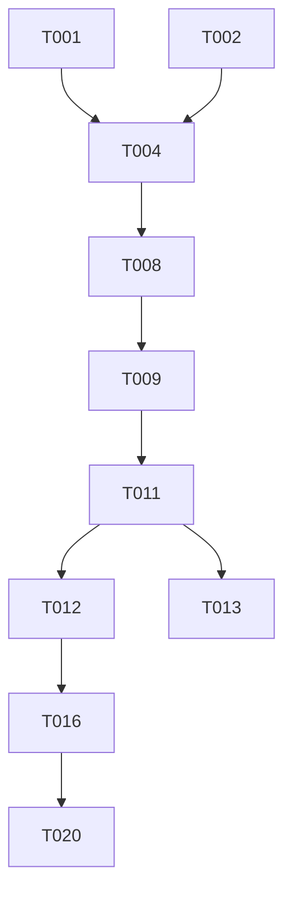

# Tasks: Command Router & Chat Grammar

**Feature Branch**: `006-command-router`
**Spec**: [spec.md](./spec.md)
**Plan**: [plan.md](./plan.md)

## Phase 1: Setup

**Goal**: Prepare environment and documentation for the router feature.
**Tests**: N/A for documentation setup.

- [ ] T001 Create documentation structure in `docs/add-core/master-router.md`
- [ ] T002 [P] Create initial `COMMAND-ROUTER.md` protocol file in `.prompt-os/core/` with headers
- [ ] T003 Update `INPUT-CLASSIFIER.md` to include reference to new Router protocol (placeholder)

## Phase 2: Foundational (Router Protocol)

**Goal**: Define the core grammar and routing logic in the protocol file.
**Tests**: Manual validation of grammar parsing logic.

- [ ] T004 [US1] Define core grammar rules (EBNF-based) in `.prompt-os/core/COMMAND-ROUTER.md`
- [ ] T005 [US1] Define standard flag definitions (`--here`, `--ia`, `--help`) in Router protocol
- [ ] T006 [US1] Define Router Map (Command → Workflow mapping) in `.prompt-os/core/COMMAND-ROUTER.md`
- [ ] T007 [US1] Implement "Strict Start-of-Line" rule documentation in `INPUT-CLASSIFIER.md`

## Phase 3: User Story 1 - Command Routing & Parsing (P1)

**Goal**: Enable reliable parsing of commands and flags from user input.
**Independent Test**: Verify inputs like `#init --here` are correctly parsed into command components.

- [ ] T008 [US1] Implement argument parsing logic (quoted strings support) in Router protocol instructions
- [ ] T009 [US1] Implement flag parsing logic (Last Flag Wins strategy) in Router protocol instructions
- [ ] T010 [US1] Implement interactive fallback instructions for missing agents in Router protocol
- [ ] T011 [US1] Update `INPUT-CLASSIFIER.md` to actively delegate `#` prefixed messages to Router

## Phase 4: User Story 2 - Standard Lifecycle Commands (P2)

**Goal**: Connect parsed commands to their respective workflows.
**Independent Test**: Verify `#init` triggers Bootstrap, `#sync` triggers Sync, etc.

- [ ] T012 [P] [US2] Map `#init` command to `BOOTSTRAP.md` workflow in Router Map
- [ ] T013 [P] [US2] Map `#add` command to `BOOTSTRAP-AGENT.md` workflow in Router Map
- [ ] T014 [P] [US2] Map `#sync` command to `SYNC-CONTEXT.md` workflow in Router Map
- [ ] T015 [P] [US2] Map `#update` and `#impl` commands to their respective flows

## Phase 5: User Story 3 - Help & Usage Assistance (P3)

**Goal**: Provide helpful feedback for errors and help requests.
**Independent Test**: Verify `#add --help` displays usage info.

- [ ] T016 [US3] Create standard "Usage Help" template in `COMMAND-ROUTER.md`
- [ ] T017 [US3] Create standard "Error Response" template for unknown commands
- [ ] T018 [US3] Define logic to trigger Help template when `--help` flag is present
- [ ] T019 [US3] Define logic to trigger Error template when command parsing fails

## Phase 6: Polish & Cross-Cutting

**Goal**: Finalize documentation and verify cross-model compatibility.

- [ ] T020 Review and finalize `docs/add-core/master-router.md` with examples
- [ ] T021 Validate `INPUT-CLASSIFIER.md` integration flow (read-through)
- [ ] T022 Cross-model validation checklist (verify consistency instructions)

## Dependencies

## Parallel Execution Opportunities

- T012, T013, T014, T015 can be executed in parallel (Mapping distinct commands).
- T001 and T002 can be executed in parallel (Doc setup vs Protocol setup).
- T016 and T017 can be executed in parallel (Help vs Error templates).

## Implementation Strategy

1. **MVP (Phase 1-3)**: Establish the Router protocol and parsing logic. Ensures basic commands are recognized.
2. **Lifecycle (Phase 4)**: Wire up the actual useful commands.
3. **UX (Phase 5)**: Add the "nice to have" help and error messages.
