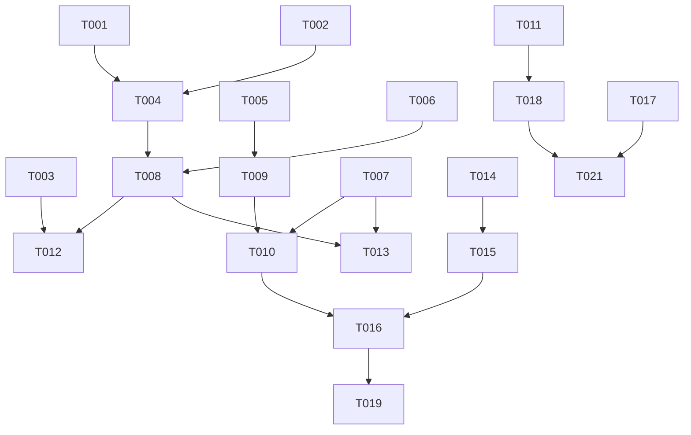

# Tasks: Workflow & Persona Orchestrator

**Feature Branch**: `007-workflow-orchestrator`
**Spec**: [spec.md](./spec.md)
**Plan**: [plan.md](./plan.md)

---

## Phase 1: Setup

**Goal**: Create the protocol skeleton and wire it into the existing chain.

- [x] T001 Create `.prompt-os/core/WORKFLOW-ORCHESTRATOR.md` with standard protocol headers (Version, Purpose, Identity)
- [x] T002 [P] Update `.prompt-os/core/INPUT-CLASSIFIER.md` to add delegation reference to `WORKFLOW-ORCHESTRATOR.md` after Router step
- [x] T003 [P] Update `.prompt-os/core/COMMAND-ROUTER.md` to document `--persona` and `--skills` as valid flags in the Standard Flags table

---

## Phase 2: Foundational (Orchestration Map & Resolution Flow)

**Goal**: Define the core static map and the resolution algorithm that all user stories depend on.

- [x] T004 Define the full 7-workflow Orchestration Map table in `.prompt-os/core/WORKFLOW-ORCHESTRATOR.md` (workflows, personas, skill sets in priority order)
- [x] T005 Define the `{stack-skill}` placeholder convention and document how it resolves from `.context/_meta/tech-stack.md` in the Orchestrator protocol
- [x] T006 Define the 5-step Resolution Flow (Lookup → Stack Resolve → Persona Override → Skills Merge/Eviction → Output) in `.prompt-os/core/WORKFLOW-ORCHESTRATOR.md`
- [x] T007 Define warning message templates in the Orchestrator protocol (missing stack, invalid persona, skill eviction notification)

---

## Phase 3: User Story 1 - Consistent Persona & Skill Selection (P1)

**Goal**: Trigger any of the 7 workflows and have the correct persona + skills activate automatically.
**Independent Test**: Trigger `#impl`, `#review`, and `#bug` in sequence. Verify each produces the correct persona and expected skill set from the map.

- [x] T008 [US1] Implement automatic Orchestration Map lookup logic in `.prompt-os/core/WORKFLOW-ORCHESTRATOR.md` — given a workflow name, output the bound persona and skill list
- [x] T009 [US1] Implement stack-skill resolution instructions in the Orchestrator — read `.context/_meta/tech-stack.md`, inject `{stack-skill}` into the active skill set for workflows that use it (`#impl`, `#bug`)
- [x] T010 [US1] Implement the "warn & generic fallback" path: if `.context/_meta/tech-stack.md` is missing or stale, emit warning template and omit `{stack-skill}` from the active set
- [x] T011 [US1] Update `.prompt-os/core/JIT-PROTOCOL.md` to document that skill loading is now triggered by the Orchestrator's Active Context output (not ad-hoc)

---

## Phase 4: User Story 2 - Manual Override of Persona & Skills (P2)

**Goal**: `--persona` and `--skills` flags correctly modify the active context without breaking defaults.
**Independent Test**: Run `#impl --persona architect` and verify persona changes while skills remain. Run `#review --skills tdd,system-design` and verify skills merge correctly within the 5-skill cap.

- [x] T012 [P] [US2] Implement `--persona` override logic in `.prompt-os/core/WORKFLOW-ORCHESTRATOR.md` — replace default persona with the specified value
- [x] T013 [P] [US2] Implement invalid persona fallback: if `--persona` value is not in the 7 valid personas, emit "warn & list" template and revert to workflow default
- [x] T014 [US2] Implement `--skills` merge logic — append user-requested skills to the default set without replacing
- [x] T015 [US2] Implement explicit-first eviction: if merged skill count > 5, evict default skills in reverse priority order until cap is met; emit eviction warning

---

## Phase 5: User Story 3 - JIT-Compliant Skill Loading (P3)

**Goal**: Skill count never exceeds 5; only relevant skills for the detected stack are loaded.
**Independent Test**: Trigger `#impl` in a Python project context — verify exactly the Python skill + 2 domain skills load (total ≤ 5). Trigger `#docs` with no stack file — verify only 2 generic skills load.

- [x] T016 [US3] Implement skill-count enforcement gate in `.prompt-os/core/WORKFLOW-ORCHESTRATOR.md` — final validation step before passing Active Context to JIT that asserts `len(skills) >= 2 && len(skills) <= 5`
- [x] T017 [US3] Implement "last command wins" reset logic — document that each new workflow command produces a fresh Active Context with zero carry-over from any prior command
- [x] T018 [US3] Update `.prompt-os/core/JIT-PROTOCOL.md` with the Orchestrator integration contract: JIT receives an Active Context object and loads exactly those skills, no more

---

## Phase 6: Polish & Cross-Cutting

**Goal**: Finalize documentation, validate the full chain end-to-end, prepare cross-model checklist.

- [x] T019 Review and finalize `docs/add-core/master-router.md` to include Orchestrator usage (persona/skills flags)
- [x] T020 Create cross-model validation checklist in `specs/007-workflow-orchestrator/cross-model-validation.md` covering all 7 workflows + override scenarios; include explicit sign-off rows for FR-008 and SC-004 (cross-model consistency)
- [x] T021 End-to-end read-through: trace `#impl --persona architect --skills tdd` through Router → Classifier → Orchestrator → JIT and verify instructions are consistent across all 4 files
- [x] T022 Verify `contracts/orchestration-map.yaml` is consistent with the final Orchestration Map table in the protocol

---

## Dependencies

## Parallel Execution Opportunities

- T002 and T003 can run in parallel (different files: INPUT-CLASSIFIER vs COMMAND-ROUTER).
- T012 and T013 can run in parallel (persona override vs persona validation — same file but independent logic blocks).
- T008 and T005 can run in parallel (map lookup logic vs stack-skill convention definition).

## Implementation Strategy

1. **MVP (Phases 1-3)**: Establish the Orchestrator protocol, the static map, and automatic persona/skill selection. This alone delivers the core value: users no longer need to manually think about personas or skills.
2. **Override Layer (Phase 4)**: Add `--persona` and `--skills` flexibility. Builds on Phase 3's foundation.
3. **JIT Integration & Enforcement (Phase 5)**: Wire the Orchestrator output into JIT and enforce the skill cap as a hard gate.
4. **Polish (Phase 6)**: Documentation, cross-model validation, consistency checks.
